# Health Monitoring Platform Instructive

## Main Window

The health monitoring platform has three options: **Data Acquisition**, **Training/Validation**, and **Monitoring**. Each option opens a different window with its own graphics and functionalities, which are explained in this document.

---

## Data Acquisition
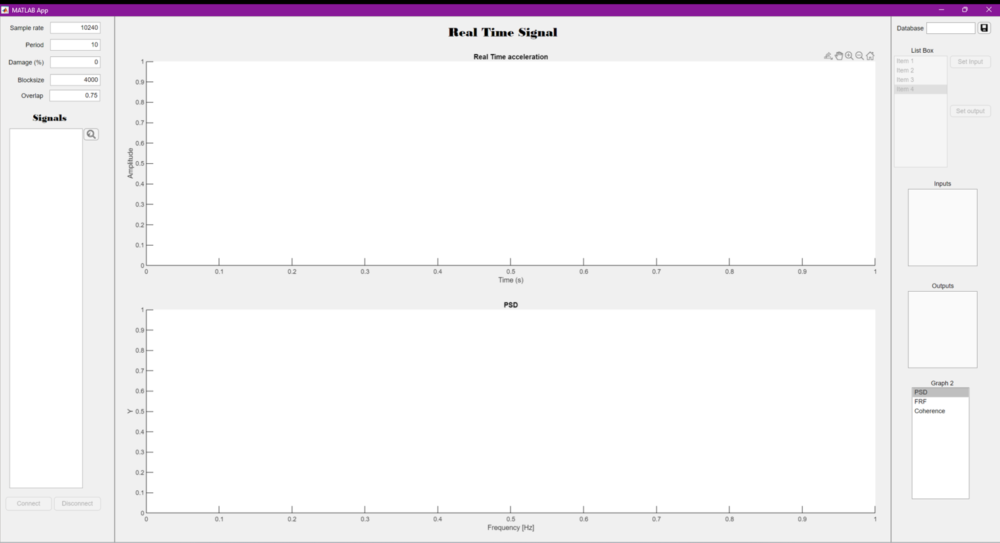

The data acquisition window allows real-time monitoring of sensor signals connected to the computer. The system will automatically detect the connected DAQs, and once the desired sensors are selected, it will display the **real-time acceleration** and compute the **Power Spectral Density (PSD)**, **Frequency Response Function (FRF)**, or **Coherence**, depending on the selected option. These graphs update based on the time set in the **"Period"** text field.

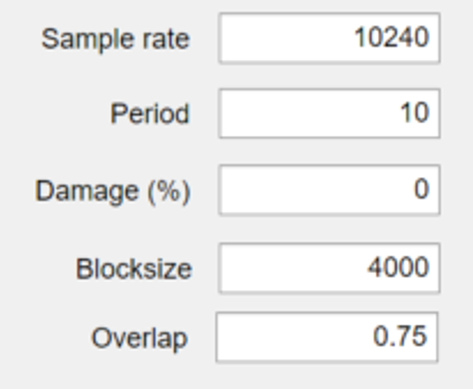 On the upper left side of the window, we can specify the conditions for our data reading. We have the sample rate that is the number of samples we are going to take each second; the period, which is the time span we will use for calculating the PSD and the FRF; the damage percentage which we can specify in order to use the acquired data as a base for damage classification; the block size, and overlap, both used for the calculation of FRF, PSD and coherence with the functions pwelch and cpsd 

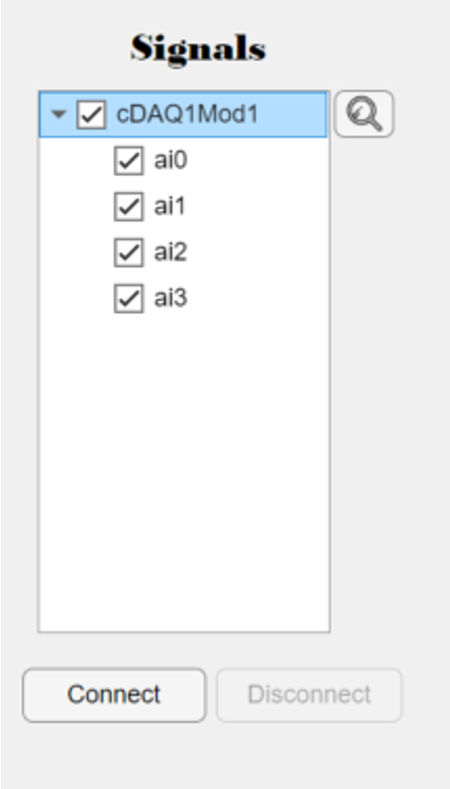 After stablishing the parameters, we can click on the search button so the system will identify the DAQ connected and show all the possible entries. Then we check the ones we are going to use and click connect. The real time graph will appear in the center of the window and after the specified time the PSD, FRF or Coherence graph will also be displayed

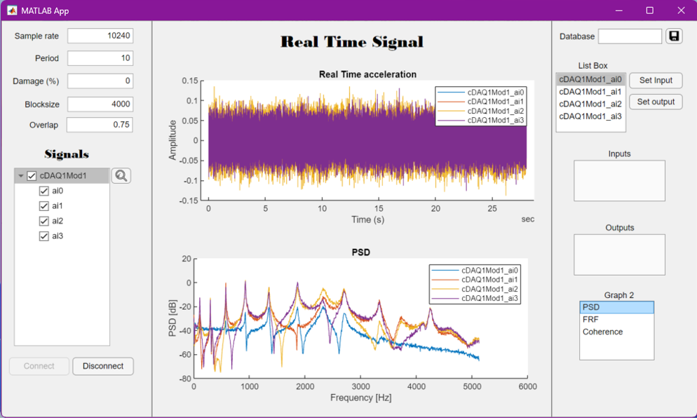 

You can choose will graph to display in the lower right corner, just selecting it. It will refresh once the given period is completed. For the FRF, if you don’t have any input selected it will automatically choose the first sensor or entry as the input signal and the rest as the outputs or response signals.

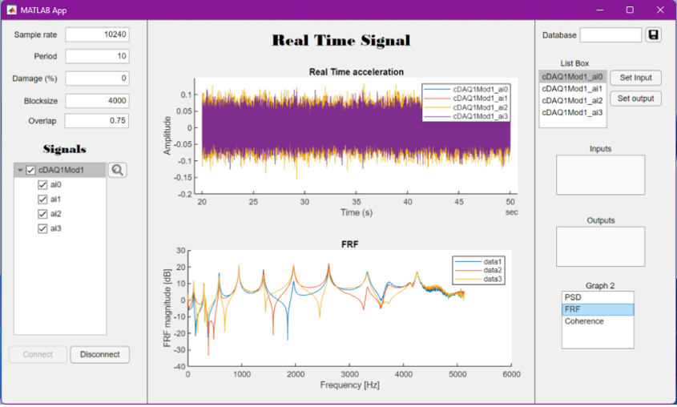 

To choose a different excitation or input signal, select it from the List Box and click the button “Set input”, only one input can be selected, if a second one is selected it will replace the first one.
You can also add the output signals with the button “Set output”, although the app will automatically display the rest as output in the graph.

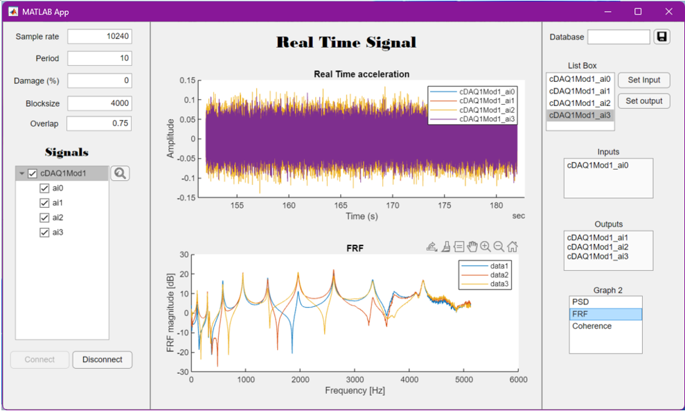 

Finally, you can click the “disconnect” button in order to stop the graphics and data reading, and then save the database typing the name for it on the upper right text edit field and clicking on the save button.

 The database will be exported and saved in MATLAB’s path folder. The data it stores contains all the information from the Edit fields, the selected inputs and outputs displayed on the text fields and a Timetable with all the data collected from the sensors with their respective timestamp.

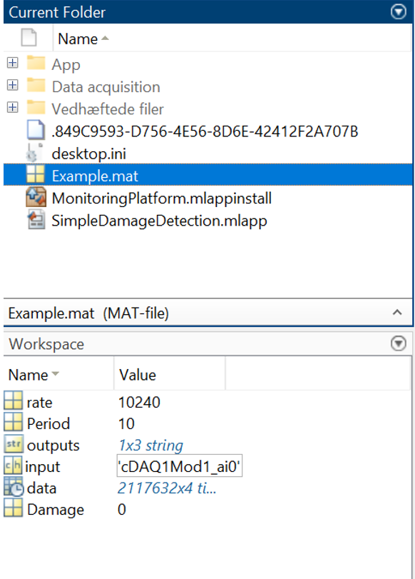 

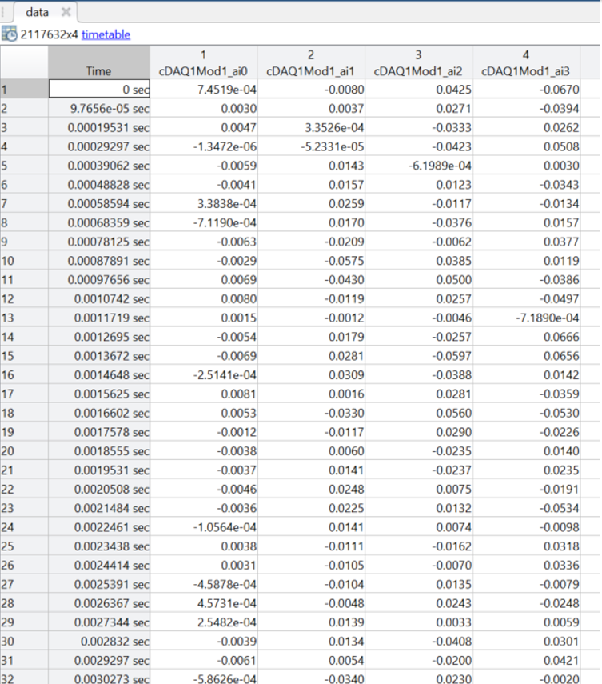 

### Configuration
- **Sample Rate**: Number of samples per second.
- **Period**: Time span for PSD and FRF calculations.
- **Damage Percentage**: Allows acquired data to serve as a reference for damage classification.
- **Block Size & Overlap**: Used for FRF, PSD, and Coherence calculations via `pwelch` and `cpsd` functions.

### Steps to Acquire Data
1. Click the **Search** button to detect the DAQs.
2. Select the desired sensor inputs and click **Connect**.
3. The real-time graph will appear in the center.
4. Once the period completes, the **PSD, FRF, or Coherence** graph will be displayed.
5. Select the graph to display in the lower-right corner. The FRF automatically selects the first sensor as the input if none is manually set.
6. To change the input signal, select it in the List Box and click **Set Input** (only one input allowed).
7. Use **Set Output** to select response signals; the rest will be automatically displayed as output.
8. Click **Disconnect** to stop data acquisition.
9. Save the database by entering a name in the upper-right text field and clicking **Save**.

The database is exported and stored in **MATLAB's path folder**, including:
- Configuration parameters.
- Selected input/output sensors.
- A **Timetable** containing all sensor data with timestamps.

---

## Training/Validation

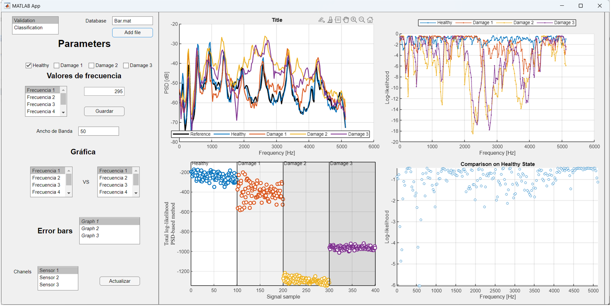 

The validation window includes multiple features and four graphs:
- **PSD Graphs**
- **Coherence Graph**
- **Total Log-likelihood vs. Signal Sample**
- **Comparison on Healthy State**

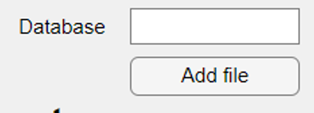 

Firstly, there is the option to add a file serving as a database, its extension must be ".mat", and it will contain sensor data under 4 damage conditions: "Healthy", "Damage 1", "Damage 2", "Damage 3", "Damage 4".

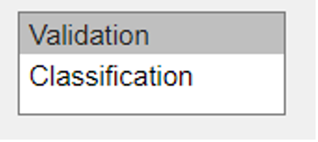 

Moreover, there is the option to validate or classify the data; by default, it is set to validation, and if classification is required, this option should be changed.

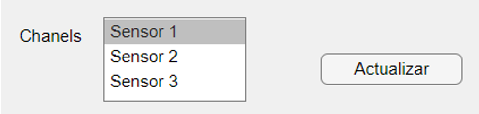 

Additionally, the signal channel can be changed. If analysis of a specific sensor is needed, the channel option should be adjusted.

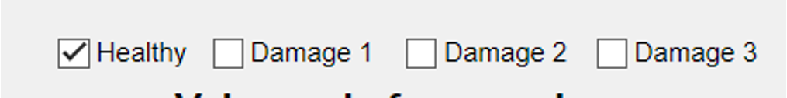 

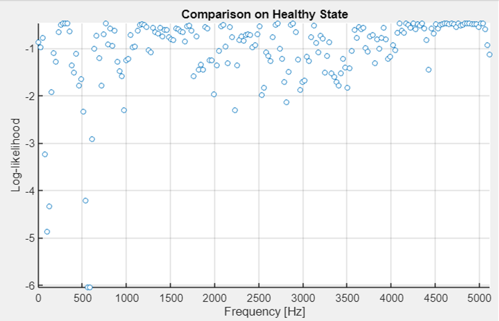 

Within the Log-likelihood graph, one can select the data to be represented. The checkboxes that are marked will display the states that will be visualized.

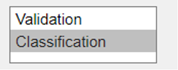 

Once the validation graph display is complete, classification graphs follow.

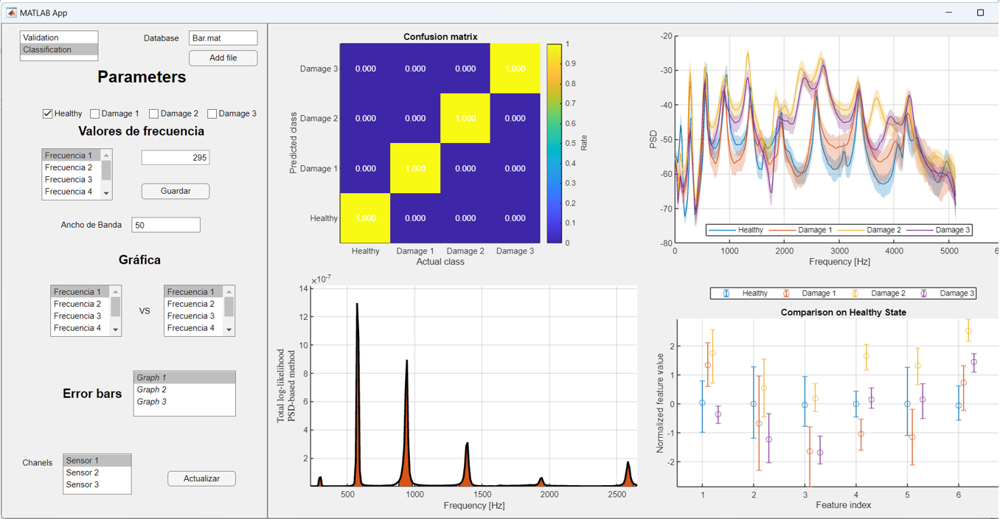 

For data classification, 4 graphs are shown: Confusion matrix, Mean PSD graph, Bandwidth frequencies, and Error bars based on states.

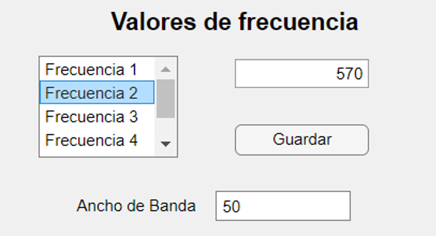 

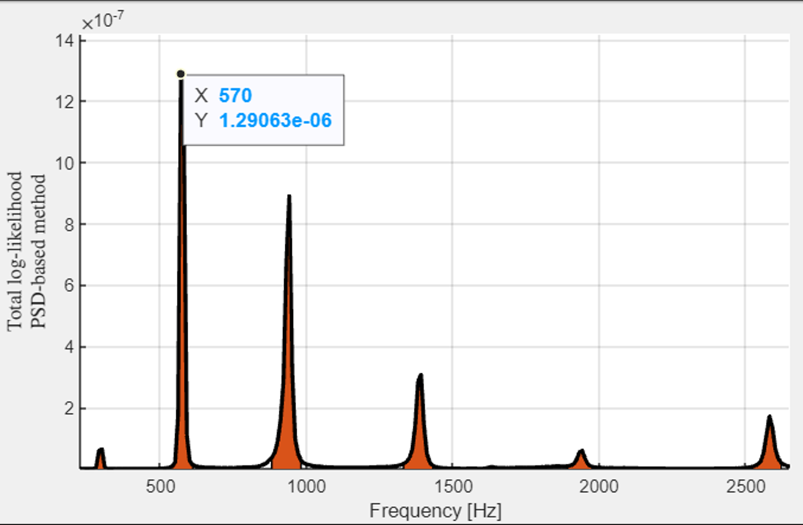 

In the Bandwidth frequencies option, the bandwidth and frequencies to be analyzed can be selected. The value of each frequency can be updated, and the save button must be pressed to perform another analysis.

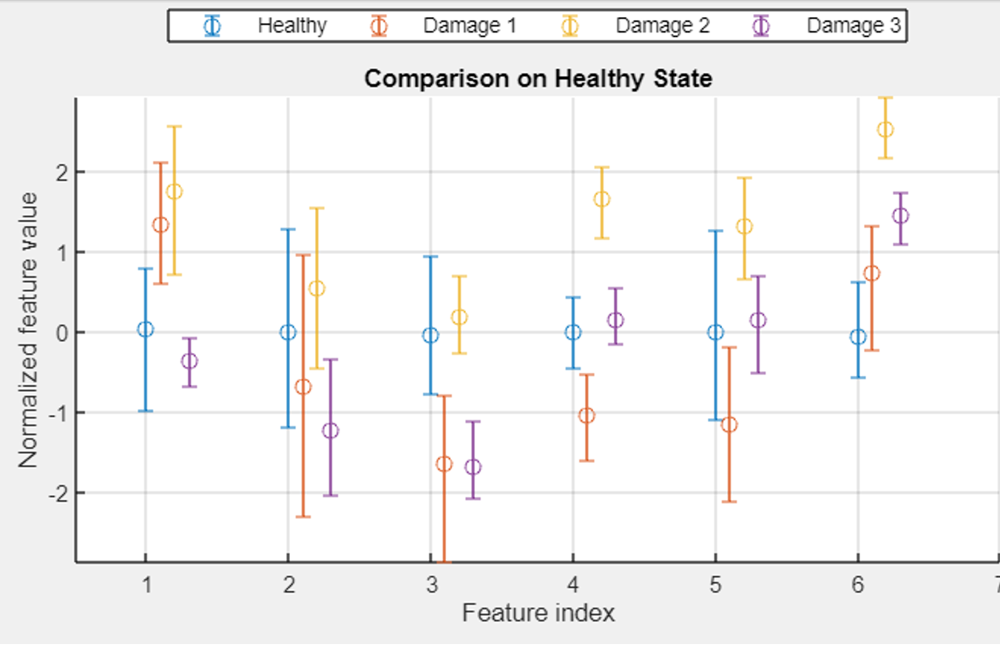 

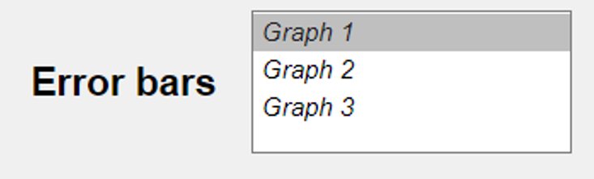 

In the error bars graph, the graph to be analyzed can be selected, and it will update automatically without needing to press the save button.

### Adding a Database
- The database file must have a **.mat** extension.
- It should contain sensor data under five damage conditions:
  - **Healthy**
  - **Damage 1**
  - **Damage 2**
  - **Damage 3**
  - **Damage 4**

### Validation vs. Classification
- By default, the system is set to **Validation**.
- If **Classification** is needed, change the option accordingly.
- The **Signal Channel** can be adjusted to analyze data from a specific sensor.

### Log-likelihood Graph
- Select the states to be visualized using the checkboxes.
- The corresponding validation graph will be displayed.

### Classification Graphs
For data classification, four graphs are provided:
1. **Confusion Matrix**
2. **Mean PSD Graph**
3. **Bandwidth Frequencies**
4. **Error Bars Based on States**

- In **Bandwidth Frequencies**, the user can select the bandwidth and frequencies for analysis. Update frequency values and click **Save** to apply changes.
- In **Error Bars**, the graph updates automatically when a new graph is selected.
