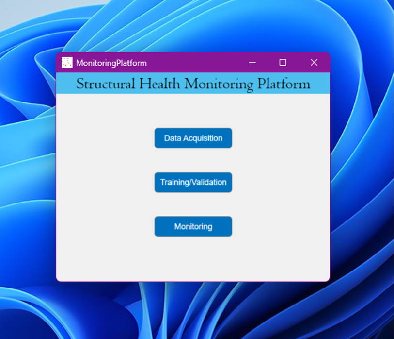

# Health Monitoring Platform Instructive

## Main Window

The health monitoring platform has three options: **Data Acquisition**, **Training/Validation**, and **Monitoring**. Each option opens a different window with its own graphics and functionalities, which are explained in this document.

---

## Data Acquisition

The data acquisition window allows real-time monitoring of sensor signals connected to the computer. The system will automatically detect the connected DAQs, and once the desired sensors are selected, it will display the **real-time acceleration** and compute the **Power Spectral Density (PSD)**, **Frequency Response Function (FRF)**, or **Coherence**, depending on the selected option. These graphs update based on the time set in the **"Period"** text field.

### Configuration
- **Sample Rate**: Number of samples per second.
- **Period**: Time span for PSD and FRF calculations.
- **Damage Percentage**: Allows acquired data to serve as a reference for damage classification.
- **Block Size & Overlap**: Used for FRF, PSD, and Coherence calculations via `pwelch` and `cpsd` functions.

### Steps to Acquire Data
1. Click the **Search** button to detect the DAQs.
2. Select the desired sensor inputs and click **Connect**.
3. The real-time graph will appear in the center.
4. Once the period completes, the **PSD, FRF, or Coherence** graph will be displayed.
5. Select the graph to display in the lower-right corner. The FRF automatically selects the first sensor as the input if none is manually set.
6. To change the input signal, select it in the List Box and click **Set Input** (only one input allowed).
7. Use **Set Output** to select response signals; the rest will be automatically displayed as output.
8. Click **Disconnect** to stop data acquisition.
9. Save the database by entering a name in the upper-right text field and clicking **Save**.

The database is exported and stored in **MATLAB's path folder**, including:
- Configuration parameters.
- Selected input/output sensors.
- A **Timetable** containing all sensor data with timestamps.

---

## Training/Validation

The validation window includes multiple features and four graphs:
- **PSD Graphs**
- **Coherence Graph**
- **Total Log-likelihood vs. Signal Sample**
- **Comparison on Healthy State**

### Adding a Database
- The database file must have a **.mat** extension.
- It should contain sensor data under five damage conditions:
  - **Healthy**
  - **Damage 1**
  - **Damage 2**
  - **Damage 3**
  - **Damage 4**

### Validation vs. Classification
- By default, the system is set to **Validation**.
- If **Classification** is needed, change the option accordingly.
- The **Signal Channel** can be adjusted to analyze data from a specific sensor.

### Log-likelihood Graph
- Select the states to be visualized using the checkboxes.
- The corresponding validation graph will be displayed.

### Classification Graphs
For data classification, four graphs are provided:
1. **Confusion Matrix**
2. **Mean PSD Graph**
3. **Bandwidth Frequencies**
4. **Error Bars Based on States**

- In **Bandwidth Frequencies**, the user can select the bandwidth and frequencies for analysis. Update frequency values and click **Save** to apply changes.
- In **Error Bars**, the graph updates automatically when a new graph is selected.
